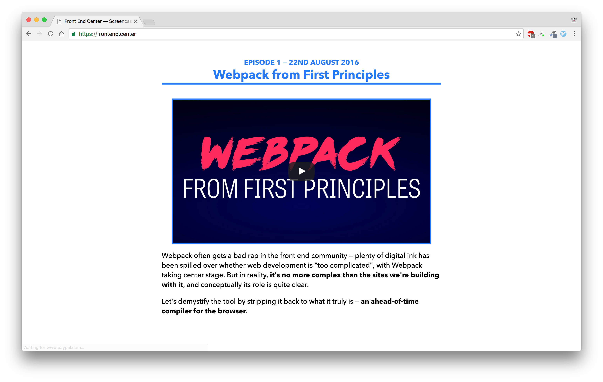
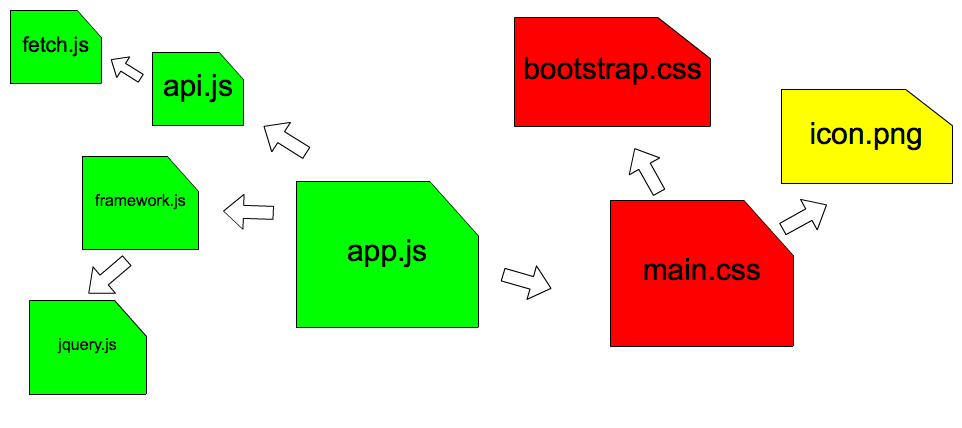
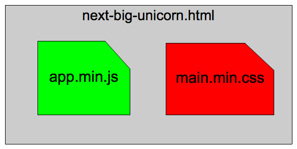

---

## The modern developer's webpack workflow

---

## 1. Google: "how to do X in webpack"

---

## 2. Find StackOverflow post

---

## 3. Copy and paste

---

## 4. It works, for now

---

## 5. But then you need to tweak it

---

# Ah.

---

---

# It doesn't have to be like this

---

# Firstly: do you _actually_ need Webpack?

---

Glen Madern: https://frontend.center/

---

# What is Webpack?

---

## "An ahead of time compiler for the browser"

---

## Webpack does what the browser would do if given your app:

- find all images in your CSS and download them
- parse your JavaScript dependencies and download them
- parse all CSS for imports and download them

---

## Webpack can do this right at the beginning

And create a more optimised bundle, saving the browser (and user) time

---

## Webpack is not just for JavaScript

---

---

---

---
