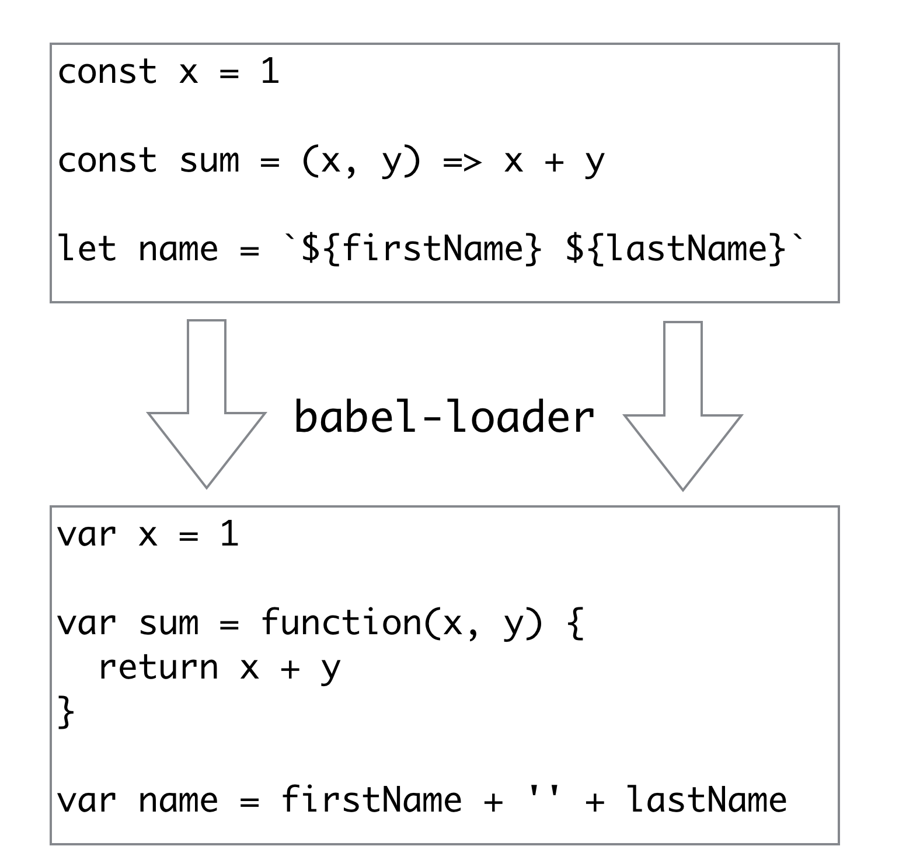
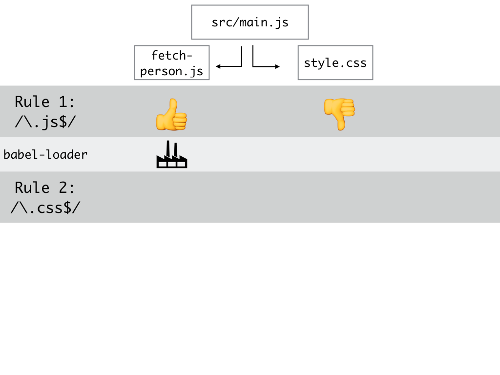
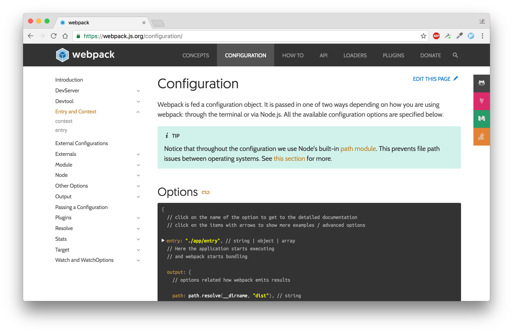

---

## The modern JS developer's workflow

---


---

## The modern developer's webpack workflow

---

## 1. Google: "how to do X in webpack"

---


---

## 3. Copy and paste

---

## 4. It works, for now

---

## 5. But then you need to tweak it

---


---


---

## Boilerplates are great, once you know the tool

---


---

# It doesn't have to be like this

---

# Firstly: do you _actually_ need webpack?

---


Glen Madern: https://frontend.center/

---

# What is webpack?

---

## "An ahead of time compiler for the browser"

---

## webpack does what the browser would do if given your app:

- find all images in your CSS and download them
- parse your JavaScript dependencies and download them
- parse all CSS for imports and download them

---

## webpack can do this right at the beginning

And create a more optimised bundle, saving the browser (and user) time

---


---

## webpack is not just for JavaScript

---


---


---


---

## webpack Terminology to tell your friends

---

## A module

Any file that your application uses. __Not__ just JavaScript. CSS, images, text files, anything.

---

## Chunk

A file, or a group of files that webpack has squashed together

---

## Entry point

A file webpack will search from to find dependencies and modules

---

## A loader

A function that takes a file's source and transforms it to return a new source file

---



---

## Let's do it

---

## `npm init -y`

PSA: Don't install things globally!

---

### `npm install --save-dev webpack@2.1.0-beta.26`

Run locally with `./node_modules/.bin/webpack`

(Or add `./node_modules/.bin` to your `$PATH`)

---

## `index.html`

```html
<!DOCTYPE html>
<html>
  <head><title>Github</title></head>
  <body><script src="dist/main.js"></script></body>
</html>
```

---

## `src/main.js`

```js
fetch('https://api.github.com/users/jackfranklin')
  .then(function(d) { return d.json() })
  .then(function(data) {
    console.log('Got github data', data)
  })
```

---

## Configuring webpack

- Where should webpack start looking?
- Where should it output to?

---

`webpack.config.js`

```js
var path = require('path')

module.exports = {
  // where should it look?
  entry: path.resolve('src', 'main.js'),

  // where should it output to?
  output: {
    path: path.resolve(__dirname, 'dist'),
    filename: 'main.js',
    publicPath: '/dist/'
  }
}
```

---

## run `webpack`

```
Hash: c09c87fc891968a374a6
Version: webpack 2.1.0-beta.26
Time: 70ms
  Asset     Size  Chunks             Chunk Names
main.js  2.63 kB       0  [emitted]  main
   [0] ./src/main.js 194 bytes {0} [built]
```

---


---

## Watching for changes

### `webpack --watch`

```js
"scripts": {
  "build:dev": "webpack --watch"
}
```

---

```
webpack is watching the files…

Hash: c09c87fc891968a374a6
Version: webpack 2.1.0-beta.26
Time: 103ms
  Asset     Size  Chunks             Chunk Names
main.js  2.63 kB       0  [emitted]  main
   [0] ./src/main.js 194 bytes {0} [built]
Hash: d9aad0a1ca8f706975ad
Version: webpack 2.1.0-beta.26
Time: 11ms
  Asset    Size  Chunks             Chunk Names
main.js  2.6 kB       0  [emitted]  main
   [0] ./src/main.js 163 bytes {0} [built]
```

---

## Refreshing is so much effort

### `npm install --save-dev webpack-dev-server@v2.1.0-beta.11`

---

## `webpack-dev-server`

```
Project is running at http://localhost:8080/
webpack output is served from /dist/
Hash: 1d366a627611ba06845c
Version: webpack 2.1.0-beta.26
Time: 947ms
  Asset    Size  Chunks             Chunk Names
main.js  247 kB       0  [emitted]  main
chunk    {0} main.js (main) 233 kB [entry] [rendered]
    [0] ./~/inherits/inherits_browser.js 672 bytes {0} [built]
    [1] (webpack)/buildin/global.js 506 bytes {0} [built]
    [2] ./~/debug/browser.js 3.76 kB {0} [built]
    [3] ./~/process/browser.js 5.3 kB {0} [built]
    ...
```

---


---

```js
"scripts": {
  "build:dev": "webpack --watch",
  "start": "webpack-dev-server"
},
```

---

## Loaders

```js
fetch('https://api.github.com/users/jackfranklin')
  .then(function(d) { return d.json() })
  .then(function(data) {
    console.log('Got github data', data)
  })
```

Would be much nicer as:

```js
const username = 'jackfranklin'
fetch(`https://api.github.com/users/${username}`)
  .then(d => d.json())
  .then(data => console.log('Got github data', data))
```

---

## Babel

```
npm install --save-dev babel-core
npm install --save-dev babel-preset-es2015
npm install --save-dev babel-loader
```

---

## `webpack.config.js`


```js
module.exports = {
  entry: path.resolve('src', 'main.js'),
  output: { ...  },
  module: {
    rules: [
    ]
  }
}
```

---

## webpack rules

Apply transformations to certain files.

---

```js
{
  // apply this rule to any files that end in ".js"
  test: /\.js$/,
  // only look for files in the src directory
  include: path.resolve('src'),
  // configure the loaders for this rule
  use: [{

  }]
}
```

---

```js
{
  test: /\.js$/,
  include: path.resolve('src'),
  use: [{
    // for files that this rule applies to
    // run the babel-loader against them
    loader: 'babel-loader',
    // specific options for the babel loader
    options: {
      presets: ['es2015']
    }
  }]
}
```

---

## `src/main.js`

```js
const username = 'jackfranklin'

fetch(`https://api.github.com/users/${username}`)
  .then(d => d.json())
  .then(d => console.log('Got Github data', d))
```

---

## Restart dev server

---


---


---

## `npm install --save whatwg-fetch`

---


## Entry points

```js
entry: {
  main: [
    'whatwg-fetch',
    path.resolve('src', 'main.js')
  ]
},
```

---


---


---

## Let's make it a bit more interactive

---

```html
<div id="app">
  <form id="github-form">
    <input type="text" id="input-box" value="jackfranklin" />
    <button type="submit">Go!</button>
  </form>
  <div id="results"></div>
</div>
<script src="dist/main.js"></script>
```

---

```js
const form = document.getElementById('github-form')
form.addEventListener('submit', e => {
  e.preventDefault()
  const username = document.getElementById('input-box').value
  fetchPerson(username)
})
```

---

```js
const fetchPerson = username =>
  fetch(`https://api.github.com/users/${username}`)
    .then(d => d.json())
    .then(displayPerson)
```

--- 

```js
const displayPerson = user =>
  document.getElementById('results').innerHTML = `
    <h1>${user.name}</h1>
    <h3>${user.company}</h3>
    <p>${user.bio || 'No Bio :('}</p>
  `
```

---


---

## Let's get some CSS in here

Remember, the goal of webpack is for it to manage _all_ our assets, CSS included.

This is weird at first but stick with me...

(Also I suck at design, please forgive)

---

```css
form {
  width: 200px;
  margin: 10px auto;
}

#results {
  width: 300px;
  margin: 0 auto;
  border: 1px solid #111;
  background: #ddd;
}
```

---

```js
import './style.css'

const username = 'jackfranklin'
...
```

---

```
ERROR in ./src/style.css
Module parse failed: /github-app/src/style.css Unexpected token (1:5)
You may need an appropriate loader to handle this file type.
| form {
|   width: 200px;
|   margin: 10px auto;
 @ ./src/main.js 3:0-22
 @ multi main
```
---

```
npm install --save-dev css-loader
npm install --save-dev style-loader
```

- CSS Loader: parses CSS files
- Style Loader: dynamically inserts stylesheets into HTML

---

## Add another rule

```js
{
  test: /\.css$/,
  include: path.resolve('src'),
  use: [{
    loader: 'style-loader',
  }, {
    loader: 'css-loader',
  }]
}
```

__Loaders are applied from right to left, or bottom to top__

---


---


---


---


---



---


---


---


---


---

## Restart webpack-dev-server

---


---

## Deploying to Production

---

## Configuring webpack differently

---

```js
"scripts": {
  "build:dev": "webpack --watch",
  "build:prod": "NODE_ENV=production webpack",
  "start": "webpack-dev-server"
},
```

---

## `npm install --save-dev webpack-config-utils`

---

```js
var { getIfUtils, removeEmpty } = require('webpack-config-utils')
var {
  ifProduction,
  ifNotProduction
} = getIfUtils(process.env.NODE_ENV || 'development')
```

- `removeEmpty`: removes `undefined` from arrays
- `ifProduction`: returns what it's given if `NODE_ENV === 'production'`
- `ifNotProduction`: returns what it's given if `NODE_ENV !== 'production'`

---

## Starting point

```
npm run build:prod

- main.js: 24.9kb
```

(All CSS is contained within main.js and dynamically inserted)

---

## Plugins

A webpack plugin will typically work on the bundle as a whole, rather than on individual files.

---

## Minifying

```js
var webpack = require('webpack')

...
output: { ...  },
plugins: removeEmpty([
  ifProduction(new webpack.optimize.UglifyJsPlugin())
]),
module: { ...  }
```

---


---


---


---

```
npm run build:prod

- main.js: 11.4kb
```

---

## Nice, but why have the CSS injected with JavaScript?

```
npm install --save-dev extract-text-webpack-plugin@v2.0.0-beta.4
```

---

```js
var ExtractTextPlugin = require('extract-text-webpack-plugin')
...
plugins: removeEmpty([
  ifProduction(new webpack.optimize.UglifyJsPlugin()),
  new ExtractTextPlugin('style.css'),
]),
```

---
```js
{
  test: /\.css$/,
  include: path.resolve('src'),
  loader: ExtractTextPlugin.extract('css-loader'),
}
```
---


---

## Deep breaths, lots of progress!

```
npm run build:prod

- main.js: 7.46kb
- style.css: 140bytes
```

---

## Finally: code splitting / lazy loading

---

## We should keep our first page load super quick

- download JS
- parse JS
- execute JS

This takes time.

---

## `src/fetch-person.js`

```js
export const fetchPerson = username =>
  fetch(`https://api.github.com/users/${username}`)
    .then(d => d.json())
    .then(displayPerson)

const displayPerson = user =>
  document.getElementById('results').innerHTML = `
    <h1>${user.name}</h1>
    <h3>${user.company}</h3>
    <p>${user.bio || 'No Bio :('}</p>
  `
```

---

```js
import './style.css'
import { fetchPerson } from './fetch-person'

const form = document.getElementById('github-form')
form.addEventListener('submit', e => {
  e.preventDefault()
  const username = document.getElementById('input-box').value
  fetchPerson(username)
})
```

---

## We only need `fetchPerson` _if_ the user clicks the button

---

```js
import './style.css'
const form = document.getElementById('github-form')
form.addEventListener('submit', e => {
  e.preventDefault()
  const username = document.getElementById('input-box').value
  System.import('./fetch-person')
    .then(module => module.fetchPerson)
    .then(fetchPerson => fetchPerson(username))
})
```

---


---

## And now we can build to production:

---

```
npm run build:prod

- main.js: 8.08kb
- 0.main.js: 387bytes
- style.css: 140bytes
```

---

## Wait, the build, went up?

This is a contrived example, because this app is tiny!

You pay a small cost because webpack has code that it inserts for lazily loading modules, but if your pages are big enough you'll get still save.

---


---

## No Lazy loading

```
bundle.app.193adde67586dd61304b.js     444 kB
```

---

## Lazily loading the graph component

```
bundle.0.513a048a93c5b8f1687b.js     431 kB
bundle.app.ce8bc2ebcec6edbff6a1.js   13.1 kB
```

---


---


---


---

## Lazy loading: not a silver bullet

But when you do want it, webpack makes it easy :)

---


## Bonus: dead code elimination

webpack 2 can parse ES2015 modules, that is:

```js
import { x } from './y'

export default function foo() {...}
```

---

ES2015 module imports and exports have to be __static__.

So we can go through them and see which ones are used and which ones aren't needed.

This means we can eliminate any code relating to ununsed exports!

---

## `src/not-used.js`

```js
export const SO_NOT_USED = 'I AM NOT USED BY ANYTHING EVER'
export const SO_USED = 'I GET USED BY THINGS'
```

## `src/main.js`

```js
import { SO_USED } from './not-used'

console.log(SO_USED)
```

---

## Doesn't work by default with Babel :(

```js
e.SO_NOT_USED="I AM NOT USED BY ANYTHING EVER"
```

---

## Stop Babel converting modules

Stop Babel converting:

```js
use: [{
  loader: 'babel-loader',
  options: {
    presets: [['es2015', { modules: false }]]
  }
}]
```

---

```js
function(t,e,r){"use strict";r.d(e,"a",function(){return n});
var n="I GET USED BY THINGS"},function(t,e){},
function(t,e,r){r(1),t.exports=r(0)}]);
```

---

## webpack 2 + ES2015 modules = smaller builds, for free!

---

## There's loads more I've not even got to yet

---



---

## webpack 2

- Much improved documentation & community engagement
- Improved configuration with a nicer API and automatic validation of config
- Tree shaking, easier code splitting and lazy loading
- More performant

---

## Fin

- Slides & code: https://github.com/jackfranklin/half-stack-webpack
- webpack 2: webpack.js.org
- Me: @Jack_Franklin, javascriptplayground.com

Thanks to: Glen Maddern, Sean Larkinn, Kent C Dodds
